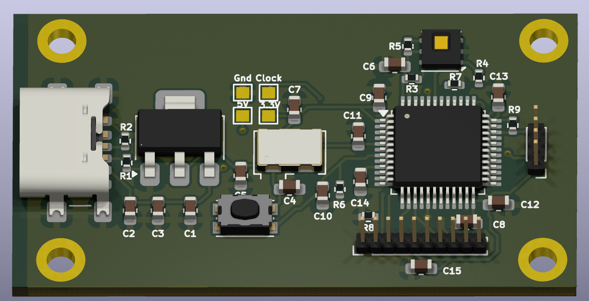

# Custom PCB

This is my project, fully made with KiCad.
The purpose is that it will show temp and hum on display (spi).

## Preview
View Website:
[Website](https://seesee010.github.io/Temp-Project/)

View PCB:

2. [PDF-Workflow](./docs/pdf/Temp-Project.pdf)

## License
